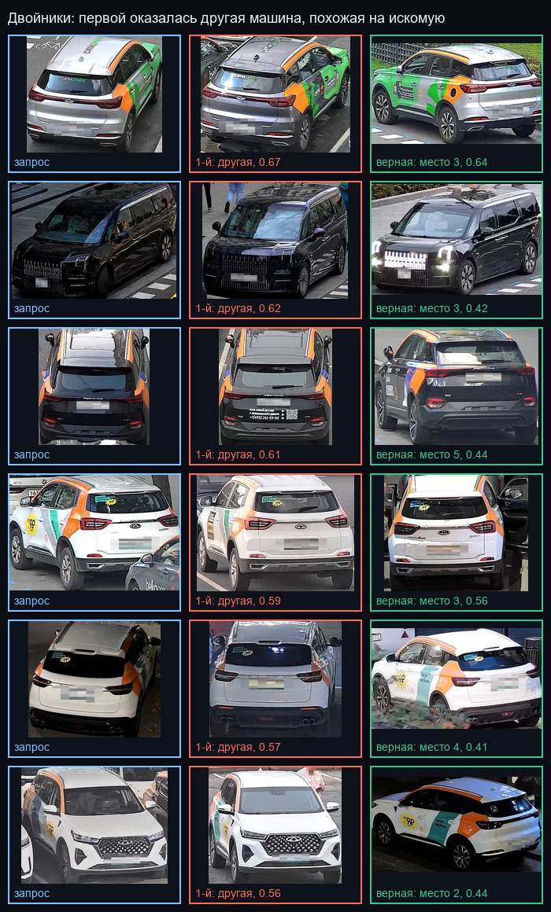
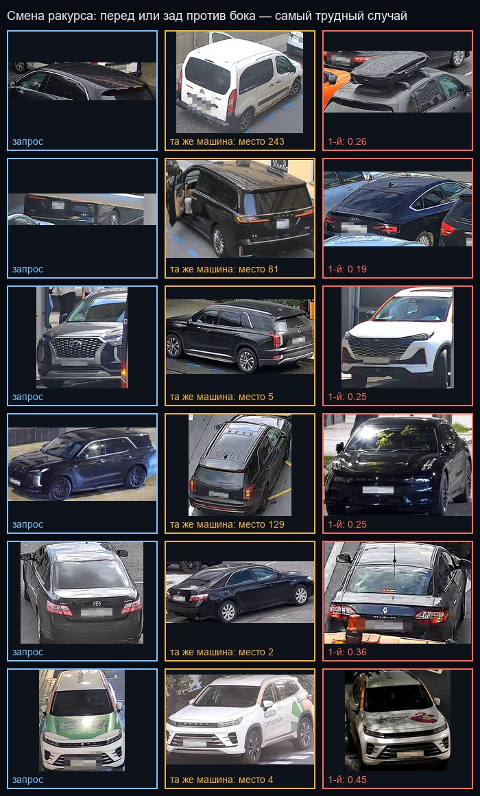
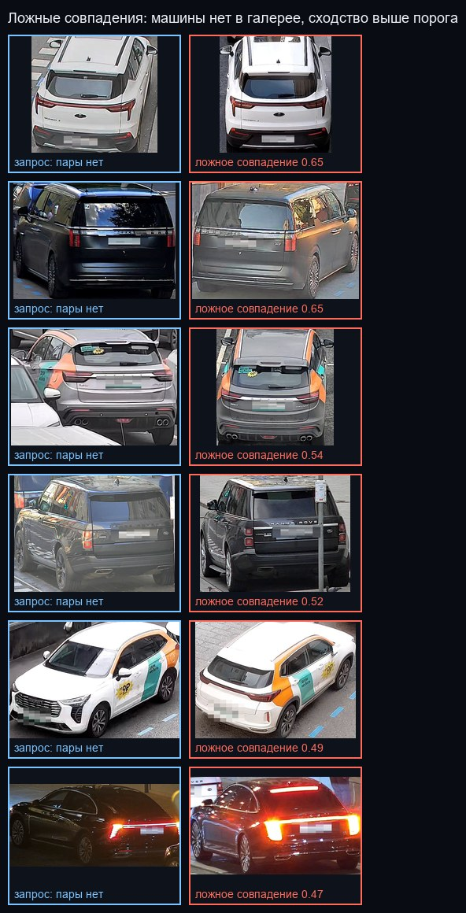
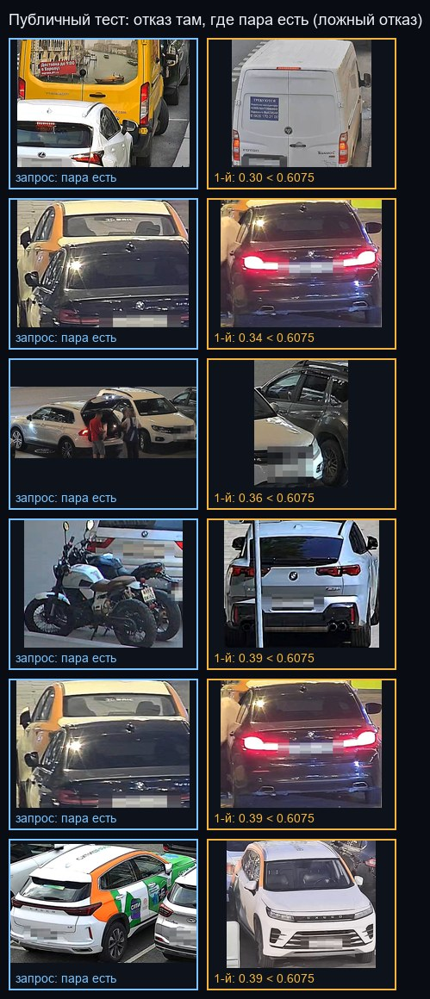

# Разбор ошибок модели

Разделы 10 и 11 ТЗ просят честно разобрать характерные провалы сопоставления,
в том числе на примерах из тестовой выборки. Здесь — где и почему модель
ошибается, с примерами и цифрами.

Модель — ансамбль из сдачи: две CLIP ViT-B/16 и ResNet50-IBN-a, дообученные с
закраской зоны номера, с PCA-проекцией в 256 измерений, порог отказа 0.605.
Протокол — официальный: снимки той же
машины с той же камеры исключаются.

Данные двух видов:

* **отложенная часть `train.csv`** — машины, которых модель не видела при
  обучении: 890 запросов, из них 182 без пары в галерее, галерея 1541 снимок.
  Здесь есть разметка, поэтому видны все типы ошибок;
* **публичный тест** (`test_query.csv`, 1110 запросов, галерея 750). Разметки
  нет, но по ответу 17 организаторов у **каждого** его запроса есть пара.
  Значит, каждый наш отказ на нём — гарантированная ошибка, и её можно показать
  на настоящих тестовых кадрах.

Разбор сделан по исходным векторам модели, без обогащения соседями, которое
применяется в пакетной сдаче: так видны ошибки самой модели. Обогащение
поднимает mAP@10 с 0.7565 до 0.7957, но природу ошибок не меняет — те же
двойники, ракурс, темнота и перекрытие.

Воспроизведение: `python scripts/error_analysis.py <каталог данных>`. Скрипт
пересчитывает таблицы (`error_analysis/stats.json`) и листы примеров.

## Итог в одном абзаце

Rank-1 на отложенной выборке — **0.798** (у прежнего ансамбля из двух ResNet
было 0.631). Сильнее всего качество по-прежнему снижают **темнота** (0.72 против
0.86) и **смена ракурса** (0.72–0.76 против 0.86). Второй
класс ошибок — **двойники**: машины одной модели и окраски, прежде всего
каршеринг и фургоны с одинаковой оклейкой; без номера их различают только
мелкие детали. На публичном тесте модель ложно отказывает в 5.4% запросов, и
почти всегда причина — **перекрытие**: машину закрывает другая машина или
люди.

## Где падает качество и что исправил CLIP

Каждый фактор делит 708 запросов с парой на четыре равные группы. Для
сравнения — те же группы у прежнего ансамбля из двух ResNet:

| Фактор | Худшая группа | Rank-1 сейчас | было | Лучшая группа | Rank-1 сейчас | было |
|---|---|---|---|---|---|---|
| Смена ракурса | перед/зад против бока | **0.757** | 0.548 | тот же ракурс | 0.859 | 0.689 |
| Яркость | самые тёмные | **0.723** | 0.582 | самые светлые | 0.864 | 0.661 |
| Резкость | самые смазанные | 0.751 | 0.576 | смазанные | 0.836 | 0.689 |
| Размер рамки | самые крупные | 0.791 | 0.582 | мелкие | 0.819 | 0.689 |

CLIP поднял все группы, но сильнее всего — трудные: смену ракурса на 21
пункт, смаз на 18, темноту на 14. От размера рамки качество теперь почти не
зависит (0.79–0.82). Предобучение на сотнях миллионов
изображений даёт признаки, которые меньше зависят от освещения и точки съёмки.
Разрыв между лучшей и худшей группой при этом остался: ракурс и темнота —
главные направления дальнейшей работы.

Ракурс оценён по пропорциям рамки: бок машины вытянут (ширина к высоте около
2), перед и зад почти квадратные. Разметки ракурса в данных нет, так что это
приближение, но разница в 10–14 пунктов слишком велика, чтобы быть шумом.

## Двойники

Первой оказывается другая машина той же модели и окраски, а верная стоит на
2–8 месте. Сходство неверного первого кандидата — 0.74–0.79, выше порога
отказа. На листе три типичных класса: каршеринг с одинаковой бело-оранжевой
оклейкой, фургоны доставки одной фирмы и чёрные минивэны одной модели. Для
визуального ReID это принципиальный предел: без номера такие машины различимы
только по наклейкам, повреждениям, грязи и мелочам в салоне.

## Смена ракурса

Запрос снят спереди или сзади, а галерея — сбоку (или наоборот). У таких пар
мало общих видимых деталей: фары, решётка и форма багажника не видны сбоку,
а профиль и диски — спереди.

## Ложные совпадения при отсутствии пары

Машины нет в галерее, но сходство с похожей машиной выше порога 0.605. Таких
32 из 182 запросов (TNR 0.824). У прежней модели при её пороге их было 13, но и
верных ответов было заметно меньше (F1 0.802 против 0.886 сейчас). Порог выбран
по баллу организаторов `0.7 × F1 + 0.3 × TNR`: новая модель чаще правильно
отвечает на запросы с парой, и выгоднее принять немного больше ложных
совпадений. Все случаи на листе — двойники: та же модель того же цвета,
одинаковая оклейка каршеринга и фургонов.

## Ложные отказы на публичном тесте

На публичном тесте у каждого запроса есть пара, а модель отказалась отвечать
в 60 запросах из 1110 (5.4%). Лист показывает шесть самых неуверенных случаев,
и в них видны причины:

* **перекрытие другой машиной** — тёмный BMW наполовину закрыт жёлтым такси,
  белый Lexus стоит перед такси, и в рамку попадают обе машины; каршеринговый
  кроссовер наполовину закрыт соседним;
* **перекрытие людьми** — у машины открыт багажник, рядом стоят люди;
* **не легковой автомобиль** — в рамке мотоцикл, а модель училась на легковых
  машинах, фургонах и минивэнах.

Цифры подтверждают картину: у отказанных запросов медианная площадь рамки 276
тыс. пикселей против 341 тыс. у остальных, а яркость и резкость почти те же
(0.389 против 0.393 и одинаковая резкость). Значит, отказы вызывает не
освещение, а то, что машина видна не целиком.

## Чего модель не делает

Опора на номер проверена так же, как её проверят организаторы (ответ 48): зона
номера закрашивается на всех снимках отложенной выборки, и mAP@10
пересчитывается (`scripts/plate_masking_check.py`). Закраска рамки номера
стоит −0.017, закраска соседнего участка кузова той же площади — до −0.017:
зона номера для модели не важнее остального бампера. Этого добились
дообучением с закраской зоны номера (`PlateZoneErase`); до него закраска
номера стоила −0.019, чуть больше контрольных зон. Интерфейс повторяет
проверку для каждой пары «запрос — кандидат» в окне сравнения.

## Пути улучшения

1. **Ракурс.** Обучение с меткой ракурса (перед/бок/зад) и отдельными
   признаками для частей кузова (part-based ReID) — известный приём для
   транспорта, дающий прирост именно на смене ракурса.
2. **Перекрытие.** Аугментация, накладывающая на кроп фрагменты других машин и
   людей, и признаки, взвешенные к центру рамки: сейчас соседняя машина в рамке
   тянет вектор к себе.
3. **Двойники.** Признаки высокого разрешения на малых деталях — наклейки,
   повреждения, багажник на крыше. Сейчас кроп сжимается до 256×256, и мелочи
   теряются; двухмасштабная модель или локальные признаки их сохраняют.
   Проверено и не помогло: дообучение всего ансамбля на 288×288 вместо 256×256
   (ночной прогон, `scripts/overnight_resolution.py`) — у первой же модели
   mAP@10 на отложенной выборке 0.7031 против 0.7092 при 256. Не помог и
   вход 224×320 с пропорциями кузова: ансамбль после 30 эпох дообучения даёт
   0.7831 против 0.7957, хуже значимо. Модели, выученные на квадрате, за
   дообучение не успевают перестроиться под новую геометрию; проверять это
   имеет смысл только обучением с нуля.
4. **Темнота.** Аугментации, имитирующие ночную съёмку, и предобучение на
   наборах с ночными кадрами (например, VERI-Wild).
5. **Отказ.** Порог, зависящий от «плотности» галереи вокруг кандидата: если
   рядом с лучшим кандидатом много почти таких же машин, уверенность должна
   быть ниже. Это прямо бьёт по двойникам — главному источнику ложных
   совпадений.
6. **Мотоциклы и спецтехника.** Доучивание на таких классах или явный отказ
   с пометкой «не легковой автомобиль», чтобы оператор видел причину.
